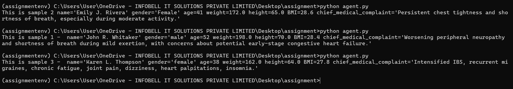

# Agent.py Script

This script utilizes OpenAI's API and Pydantic for data validation and settings management.

## Requirements

- Python 3.8 or higher
- OpenAI API key
- Required Python packages (install via pip):
  ```
  pydantic
  openai
  ```

## Setup

1. Set your OpenAI API key as an environment variable:
   ```
   export OPENAI_API_KEY=your_api_key_here  # For Unix/Linux/MacOS
   set OPENAI_API_KEY=your_api_key_here     # For Windows
   ```

   Or create a `.env` file in the project root:
   ```
   OPENAI_API_KEY=your_api_key_here
   ```

## Running the Script

To run the script, use the following command:
```
python agent.py
```

Make sure you have set up your OpenAI API key before running the script.

## Output Screenshots

*Screenshot showing the extracted patient information for all three samples*
